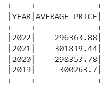
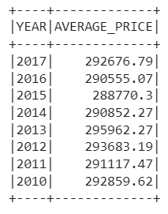
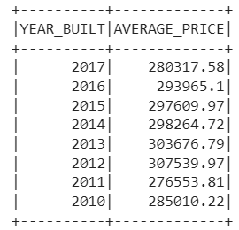
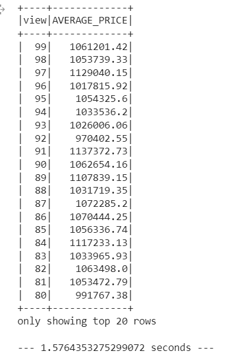
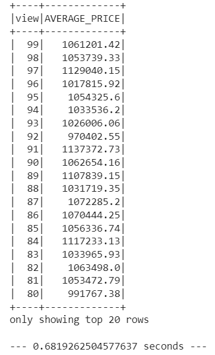
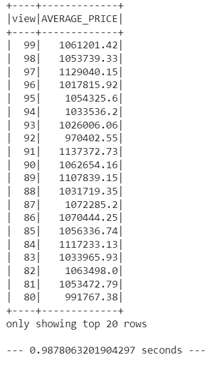

# 🏠Home Sales
module 22 repo challenge

  
---
## 🏠Table of Contents

- [Background](#background)
- [Part 1: Challenge Layout](#layout)
- [Part 2: Results](#result)
- [Part 3: Conclusion](#conclusion)

---
## 🏠Background 

Used SparkSQL to determine key metrics about home sales data. Then used Spark to create temporary views, partition the data, cache and uncache a temporary table, and verify that the table has been uncached.

---
## 🏠Part 1: Challenge Layout 

1. Rename the Home_Sales_starter_code.ipynb file as Home_Sales.ipynb.
2. Import the necessary PySpark SQL functions for this assignment.
3. Read the home_sales_revised.csv data in the starter code into a Spark DataFrame.
4. Create a temporary table called home_sales.
5. Answer the following questions using SparkSQL:
   -  What is the average price for a four-bedroom house sold for each year? Round off your answer to two decimal places.
   -  What is the average price of a home for each year it was built that has three bedrooms and three bathrooms? Round off your answer to two decimal places.
   -  What is the average price of a home for each year that has three bedrooms, three bathrooms, two floors, and is greater than or equal to 2,000 square feet? Round off your answer to two decimal places.
   -  What is the "view" rating for homes costing more than or equal to $350,000? Determine the run time for this query, and round off your answer to two decimal places.
6. Cache your temporary table home_sales.
7. Check if your temporary table is cached.
8. Using the cached data, run the query that filters out the view ratings with an average price of greater than or equal to $350,000. Determine the runtime and compare it to uncached runtime.
9. Partition by the "date_built" field on the formatted parquet home sales data.
10. Create a temporary table for the parquet data.
11. Run the query that filters out the view ratings with an average price of greater than or equal to $350,000. Determine the runtime and compare it to uncached runtime.
12. Uncache the home_sales temporary table.
13. Verify that the home_sales temporary table is uncached using PySpark.
14. Download your Home_Sales.ipynb file and upload it into your "Home_Sales" GitHub repository.

## 🏠Part 2: Results 
-  What is the average price for a four bedroom house sold in each year rounded to two decimal places?

-  What is the average price of a home for each year the home was built that have 3 bedrooms and 3 bathrooms rounded to two decimal places?

-  What is the average price of a home for each year built that have 3 bedrooms, 3 bathrooms, with two floors, and are greater than or equal to 2,000 square feet rounded to two decimal places?

-  What is the "view" rating for the average price of a home, rounded to two decimal places, where the homes are greater than
 or equal to $350,000?
 

-  Using the cached data, run the query that filters out the view ratings with average price
  greater than or equal to $350,000. Determine the runtime and compare it to uncached runtime.

-  Run the query that filters out the view ratings with average price of greater than or equal to $350,000
 with the parquet DataFrame. Round your average to two decimal places.
 Determine the runtime and compare it to the cached version.
 

  
---
## 🏠Part 3: Conclusion    
-  Caching a DataFrame or Dataset can improve the performance of repetitive or iterative operations. When you cache a DataFrame, it is stored in memory (or disk, depending on the storage level you choose) so that subsequent actions or transformations can reuse the cached data without having to recompute it from the source data. This can lead to significant time savings for operations that need to access the same data multiple times.
-  When you cache a DataFrame, it eliminates the need to re-read the data from the source and recompute the transformations on the original data. Instead, Spark simply uses the data stored in memory, which is much faster to access than reading from disk or network storage and reapplying all transformations. This is why cached versions can have shorter runtime compared to uncached DataFrames.
